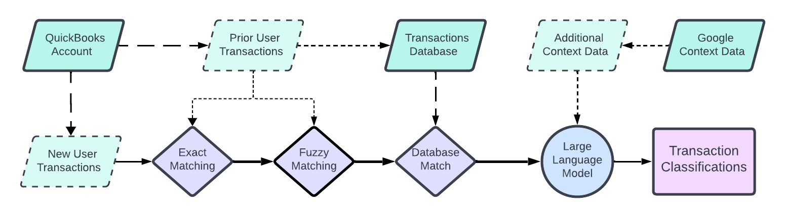

# Transaction Classification Pipeline

- [**Project Overview**](#project-overview)

- [**Installation (Need Help)**](#installation)

- [**Project Structure**](#project-structure)

- [**Architecture and Design**](#architecture-and-design)

- [**Usage**](#usage)

- [**Testing (Need Help)**](#testing)

- [**Deployment (Need Help)**](#deployment)

## **Project Overview**

- **Description:** An application that allows users to classify bank transactions in the online accounting software QuickBooks Online. It makes use of the QuickBooks API to read and update transaction data in the users profile. The app provides a simple use experience focused on being quick, easy, and minimizing the need for repeated actions.

- **Status:** The project is a fully realized version of the MVP that was defined at the start of the project. Also implements many additional features the team discovered along the way.

## **Installation**

- **Prerequisites:** Software, tools, and libraries needed before installation.

- **Setup:** Step-by-step instructions on how to set up the project locally.

- **Configuration:** Any necessary configurations, such as environment variables + an `env.example` file.

## Project Structure

- **Actions:**
  Contains all server actions that are called by the client components. Files group server actions by their purpose and what technologies they interact with.

- **Components:**
  Small competent tailwind elements that are loaded within other tailwind pages. Contains files for UI elements consistent across all pages and the different parts of the home page.

- **Lib:**
  Contains important setup files for the database and for interacting with refresh tokens for QuickBooks API.

- **Prisma:**
  Contains the schema file that prisma uses for the postgresql database.

- **Types:**
  Contains definitions for data objects that relate to classifying transactions as well as QuickBooks API data.

- **Utils:**
  Contains data formatting utility functions that are called in typescript files to reduce code complexity.

- **App:**
  Contains the typescript pages that are loaded to create the app frontend. Also contains the API call endpoints that make API calls directly and return the results.

- **App/API:**
  Contains the API calls that the app makes for authentication, searching and matching transactions, querying the LLM for predictions, and QuickBooks data retrieval.

- **App/Home:**
  Contains the home file which loads the second page of the application. This file is a staging ground to load the different components as needed.

## **Architecture and Design**

- **System Overview:** The classification process is four step system that makes use of three primary data sources (User, Database, & Google).

  - Step 1 (Exact Match): New user transactions are taken from a QuickBooks account. The new transactions are checked for exact matches against existing transactions from that user. If any are found, it is an exact match and the classification is recorded.

  - Step 2 (Fuzzy Match): The Fuse package is used to check against prior transactions for similar names. If any close matches are found, their transaction classifications are recorded on a list associated with that transaction.

  - Step 3 (Database Match): A running database is kept that stores transaction names and the associated catagories from each user. The new transactions are checked against this database and any matches are added to the list of predicted catagories. Industry matching can be implemented at this step to improve matches in the database.

  - Step 4 (LLM Prediction): If no matches have been found by the end of the third step, the pipeline passes the transactions to the LLM. It then uses context data from Google as well as other elements to predict a classification for the transaction. This is the last step and finalizes the predicted category for each of the passed transactions.

- **Technologies Used:**

  - **Frontend:**

    - React
    - Typescript
    - Tailwind CSS
    - Next.js
    - Fuse.js

  - **Backend:**

    - Python
    - Docker
    - Llama3-ChatQA-1.5
    - Google Knowledge Graph
    - Google Gemini 1.5 Flash / OpenAI 3.5 Turbo

  - **Database:**

    - Prisma
    - Postgresql

  - **QuickBooks:**
    - QuickBooks API
    - Node-QuickBooks
    - NextAuth
    - OAuth 2.0

- **Modules and Components:**

  - **App:**

    - `layout.tsx`: Defines a basic layout in typescript that all pages will use. Adds the navbar and footer components to all pages loaded with the layout.

    - `loading.tsx`: A loading page with the spinner component on it to indicate to the user that the loading is still in progress.

    - `not-found.tsx`: A 404 page to catch all users who visit invalid paths and includes a button to redirect the user to the landing page.

    - `page.tsx`: The landing page of the site that prompts users who are not logged in to log into their Intuit account. The user is then redirected to the home page. Already logged in users who redirected here see a different message and a button that takes them straight to the home page.

    - `home/page.txs`: The tailwind file for the home page that acts as the base for the selection and review components. It has a function to call and get the transactions and a function to switch between components when needed. The UI uses components and simply determines which component to display. It then passes the nessasary data and displays what the component returns.

    - `api/auth/options.ts`: Define key information for the authorization method such as token provider info, user info, max session length and setting the callbacks to use.

    - `api/auth/route.ts`: Simple route to call to check if the user is logged in and update the cookies.

    - `api/cse/route.ts`: Simple testing page to call the custom search server action and display the response.

    - `api/kg/route.ts`: Testing page to call the knowledge graph server action and display the response.

    - `api/llm/batch/route.ts`: Testing page to call the LLM with a batch of transactions to classify and show the response.

    - `api/llm/single/route.ts`: Testing page to call the LLM with a single transactions to classify and show the response.

    - `api/quickbooks/find_industry/route.ts`: Testing page to call the find industry server action and display the response.

    - `api/quickbooks/find_industry/route.ts`: Testing page to call the find purchase server action and display the response.

    - `api/quickbooks/find_accounts/route.ts`: Testing page to call the get accounts server action and display the response.

    - `api/quickbooks/get_transactions/route.ts`: Testing page to call the custom get transactions action and display the response.

    - `api/update-industry/route.ts`: Function that allows an asynchronous check if the user is logged in that then calls the users industry type from QuickBooks. Once found, it will try to update the industry associated with that user in the database.

  - **Actions:**

    - `classify.ts`: Takes transactions and classifies them using the search method. If the searching does not work it will pass them to the LLM. Returns the transactions and their predicted catagories when finished.

    - `customsearch.ts`: Uses Google's API to search for relevant information to use as context for the LLM when predicting classifications.

    - `knowledgegraph.ts`: Uses Googles Knowledge Graph to find information relevant to a particular transaction that can help the LLM to identity and predict its classification.

    - `llm.ts`: Defines the functions for calling the LLM to make predictions and well as functions that preform much of the formatting work needed to use the LLM outputs correctly.

    - `qb_client.ts`: Creates and returns an object used to call the QuickBooks API through the node-quickbooks module. It can be called by other elements to easily get the object without excessive lines of code.

    - `quickbooks.ts`: Contains multiple functions to call the different elements of the QuickBooks API, format the data received, and return it to the caller. Either returns a dictionary for a single response or an array of objects. Also defines an function to create an object to return with all queries indicate if a call was successful or not.

  - **Components:**

    - `footer.tsx`: Defines the footer component to display it consistently across all pages.

    - `navbar.tsx`: Defines the navbar component to display it consistently across all pages.

    - `review.tsx`: The second half of the home page that is displayed to users after they finish selecting and submitting the transactions to classify. Allows users to review the predicted classifications, select from options, and approve the correct classifications.

    - `selection.tsx`: The first half of the home page where the selects the transactions to classify and submits them to be categorized. Also includes an option to search for and show the transactions within a specified date range.

    - `signin`: Defines the _sign in_ button component to display it consistently across all pages.

    - `signout.tsx`: Defines the _sign out_ button component to display it consistently across all pages.

    - `spinner.tsx`: Defines an animated element to show as a loading indicator across the app.

    - `users.tsx`: Testing element that displays a table of all users in the database.

  - **Types:**

    - `Account.ts`: Defines the fields, their types, and possible values for account data pulled from the QuickBooks API.

    - `CategorizedResult.tx`: Defines an object that tracks categorized result for a transaction by its ID, the possible catagories, and what level the classification was done by.

    - `Category.ts`: Defines an object for a category by its name and ID as well as an object for a classified category with a name, ID, and what level the classification was done by.

    - `Purchase.ts`: Defines the fields, their types, and possible values for purchase data pulled from the QuickBooks API.

    - `QueryResult.ts`: Defines an object returned with all QuickBooks API data queries indicating the success or failure of the request.

    - `Transaction.ts`: Defines the fields, their types, and possible values for transaction data pulled from the QuickBooks API.

  - **Utils:**

    - `filter-transactions.ts`: Takes a list of transactions and either removes all classified transactions or keeps all classified transactions then returns the new list.

    - `format-date.ts`: Takes a date element and formats it to a string in the local time zone.

  - **Config Files:**

    - `next-auth.d.ts`:Declares modules for both JWT and Session objects to be used in the rest of the project.

    - `tsconfig.json`: The Typescript configuration of the for this project.

    - `package.json`: The packages, dependencies, and scripts used within the project.

  - **Other:**

    - `middleware.ts`: Overrides how the middleware handles redirecting users who are not currently signed in to allow for the home page to load properly.

    - `lib/db.ts`: Defines the setup for the prisma database to ensure it runs properly when running locally or hosted.

    - `lib/refreshToken.ts`: Ensures that the refresh token for the QuickBooks API is used properly to update the access token as needed.

    - `prisma/schema.prisma`: Defines the schema for the prisma database to ensure it is loaded properly.

## **Usage**

- **Examples:** Examples of how to use the main features. (Just the ones you've worked on)

- **Screenshots:**

## **Testing**

- **Test Setup:** Instructions for setting up the testing environment.

- **Running Tests:** How to run the tests and interpret the results.

- **Test Coverage:** Information on test coverage and any tools used.

## **Deployment**

- **Deployment Instructions:** Step-by-step guide on how to deploy the project.

- **Environment Configurations:** Configuration settings for different environments (development, staging, production).
